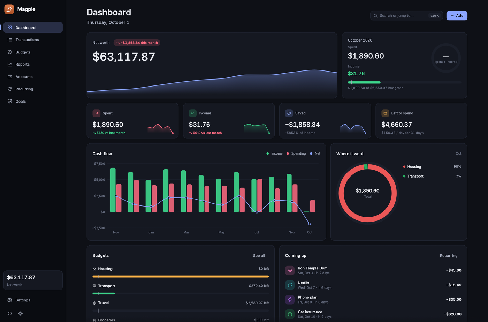
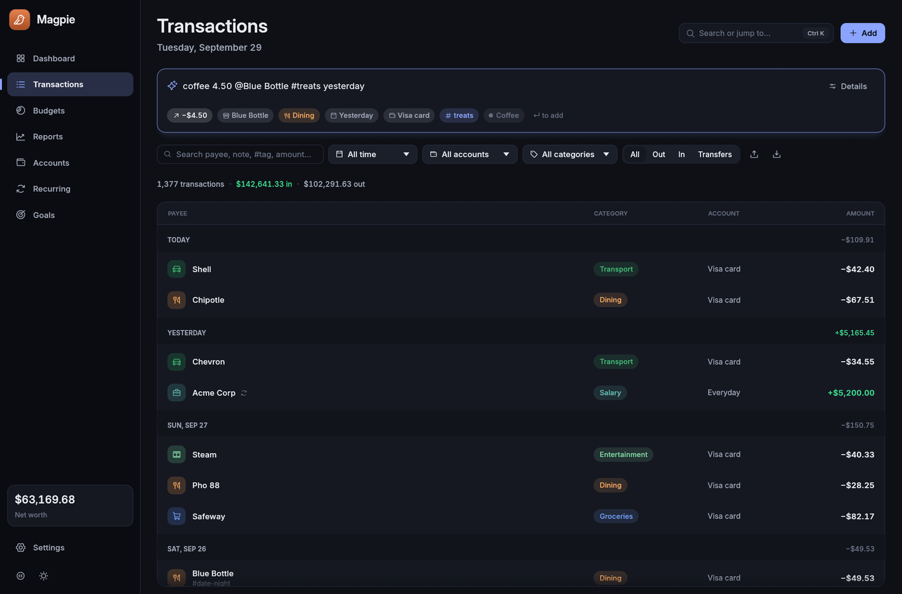
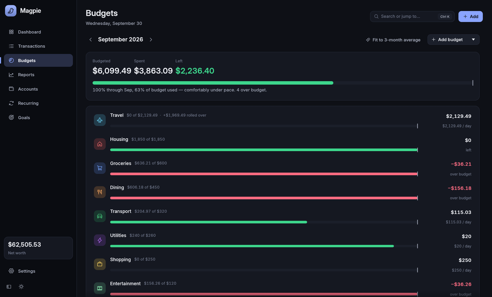
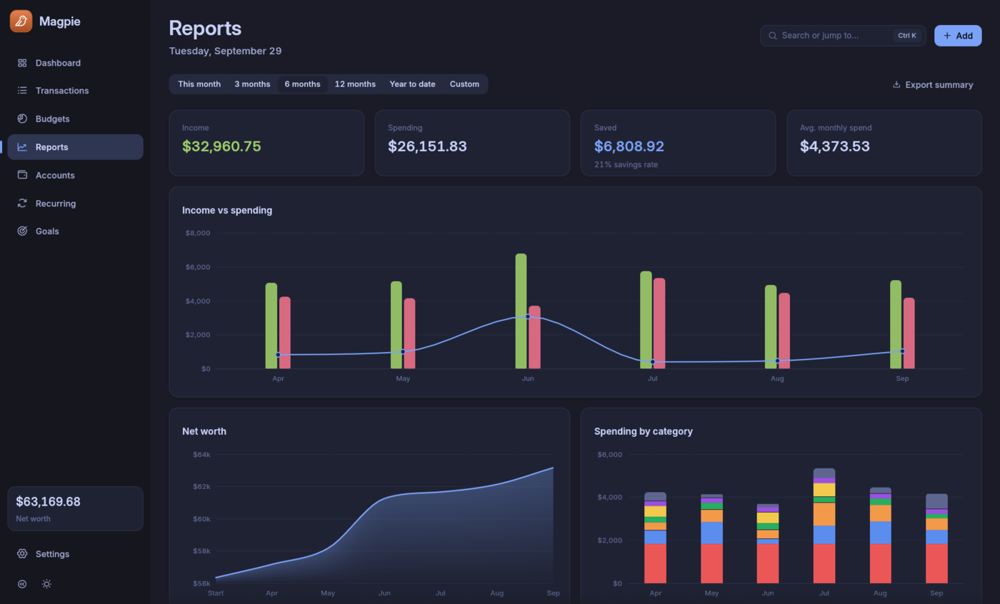
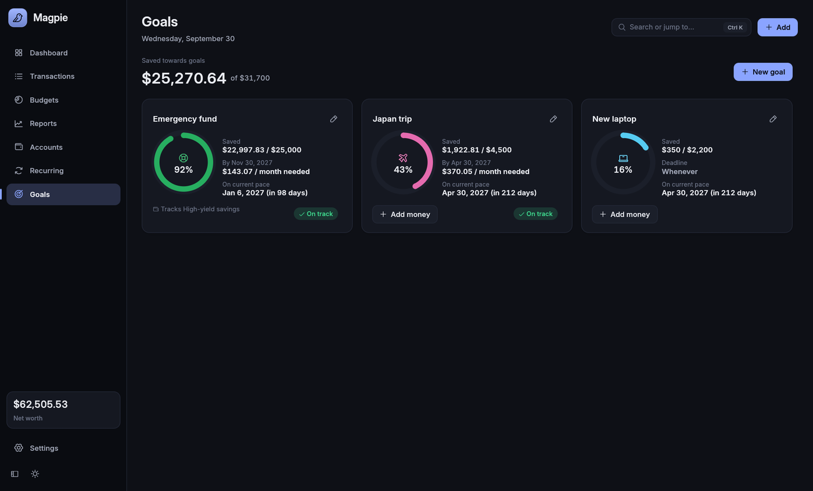
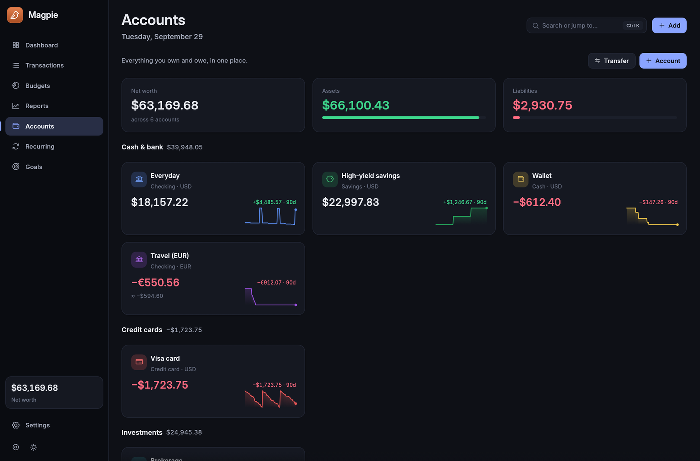
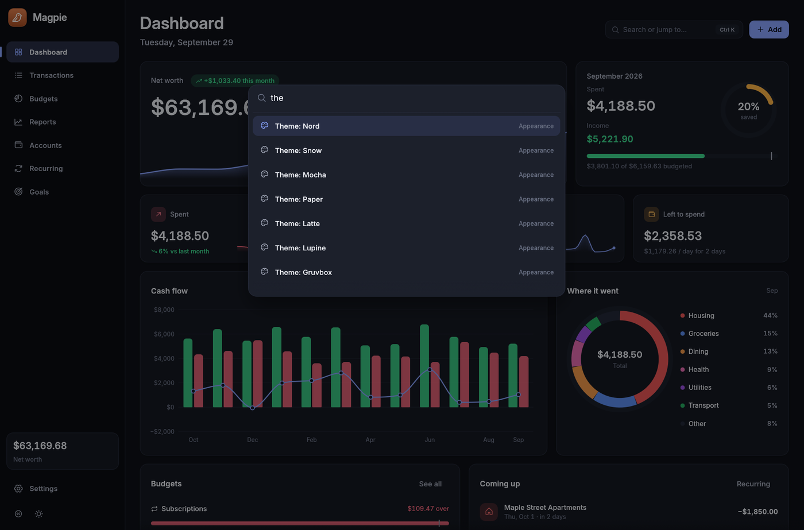
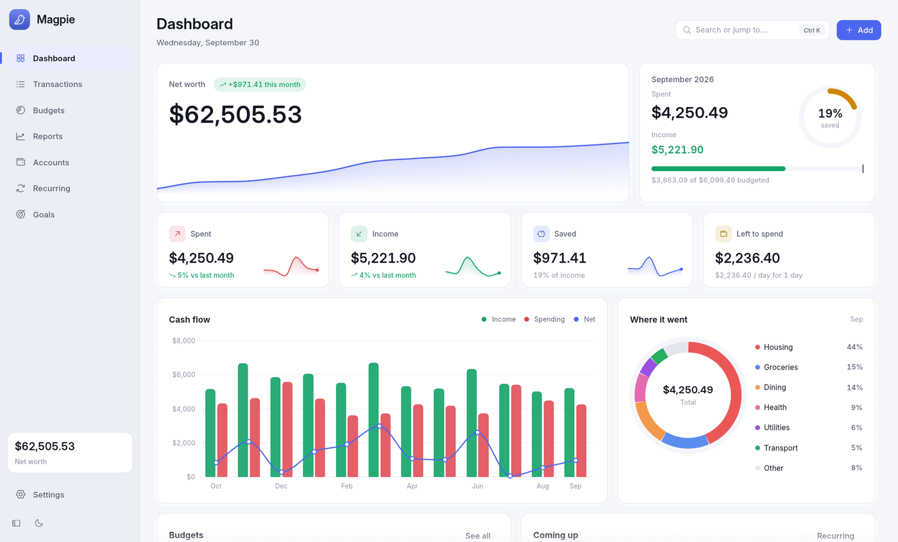
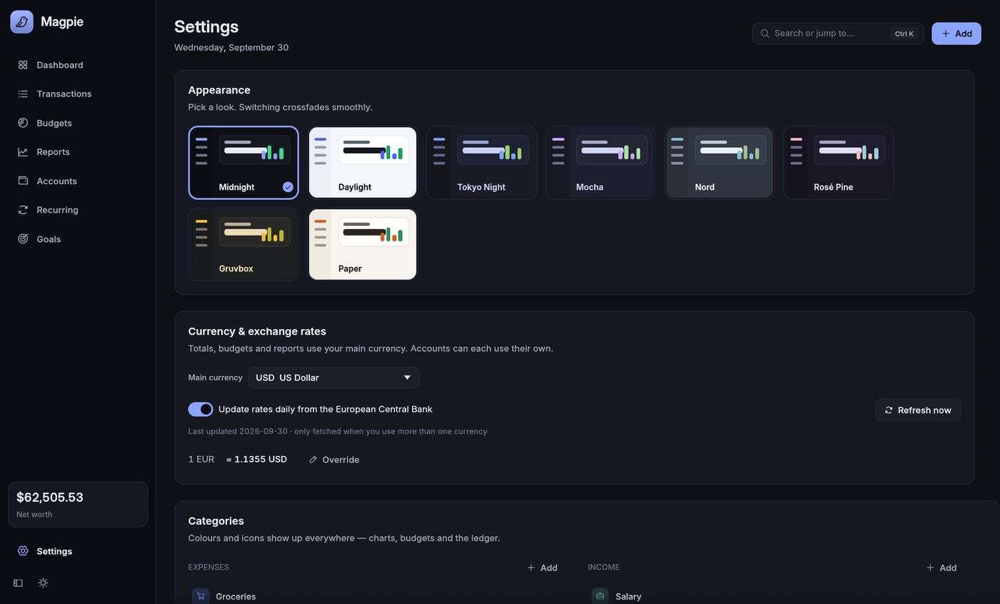

<div align="center">


# Magpie

**A fast, beautiful, local-first personal finance tracker.**

Budgets, accounts, recurring bills, savings goals, multi-currency and reports,
in a native app that opens instantly and sits at 0% CPU when idle.

[Install](#install) · [Features](#features) · [Keyboard](#keyboard) · [Your data](#your-data) · [Building](#building-from-source)



</div>

## Features

**Basic or Advanced.** Basic is Magpie for everyday money: Home, Transactions, Budgets and Accounts, in plain words, with a quick Add form. Advanced is everything below. Switch any time in Settings or with `Ctrl Shift T`; your data is the same either way.

**Dashboard.** Net worth with a 12-month trend, this month at a glance with your savings rate, KPI tiles with sparklines, a cash-flow chart, a "where it went" donut, budget health, upcoming bills, recent activity, goal progress and a month-in-review card.

**Transactions.**
- **Natural-language quick add.** Type `coffee 4.50 @Blue Bottle #treats yesterday` and Magpie works out the amount, payee, tags and date. It fills in the category from your history.
- **Fast, virtualized ledger.** It stays smooth with 100k+ transactions. Rows are grouped by day, with daily totals.
- **Import your bank's statements.** CSV, Excel or OFX, straight from your bank: Magpie finds the columns itself, and skips anything already imported.
- **Search and filters.** Search payee, note, `#tag` or amount, and filter by date range, account, category or type.
- **Multi-select.** Ctrl/Shift-click to recategorize, mark as cleared or delete in bulk.
- **Undo / redo** for every change.
- **Receipts.** Drop a photo or PDF onto a transaction.



**Budgets.**
- Monthly envelopes per category.
- Optional rollover of unspent money into the next month.
- A **pacing line** that shows where you should be today.
- "Left per day" for each category.
- One click fits every budget to your 3-month average.



**Reports.**
- Any period: this month, the last 3, 6 or 12 months, year to date, or a custom from–till range. A single month charts day by day.
- Income vs spending
- Net worth over time
- Spending by category over time
- Category breakdown with trends
- Top payees
- A 12-month spending calendar

Each chart is animated and interactive.



**Accounts and currencies.**
- Checking, savings, credit cards, cash and investments, with transfers between them.
- Each account keeps its own currency and converts to your main currency.
- Daily rates come from the European Central Bank, with manual overrides.
- Rates are only fetched when you actually use more than one currency.

**Recurring.**
- Rent, salary and subscriptions post themselves on schedule.
- A rule can ask you to confirm first instead.
- Shows what you pay per month and year, and a 30-day timeline.

**Goals.**
- Save towards anything with a target and an optional deadline.
- Add money by hand, or let a goal track an account's balance.
- Shows how much you need per month and a projected finish date.

<table>
<tr>
<td></td>
<td></td>
</tr>
<tr>
<td></td>
<td></td>
</tr>
</table>



**Everything else.**
- 16 themes, 8 light (Magpie Light, Daylight, Paper, Latte, Flexoki, Rosé Pine Dawn, Lupine, Snow) and 8 dark (Magpie Dark, Midnight, Tokyo Night, Mocha, Nord, Gruvbox, Kanagawa, Everforest), that crossfade when you switch.
- 9 bundled interface fonts, including JetBrains Mono for a monospaced look.
- A command palette (Ctrl+K), adjustable interface size and scroll speed, and keyboard shortcuts for everything (press `?`).
- Export to CSV, Excel or JSON, plus one-click database backups.
- Import from [Pear](https://github.com/ahaan-shah/pear), Magpie's terminal-based predecessor.

## Install

### Linux & macOS (one line)

```bash
curl -fsSL https://raw.githubusercontent.com/ahaan-shah/magpie/main/install.sh | sh
```

What the script does on each platform:
- **Linux:** installs `magpie` into `~/.local/bin`, and adds a desktop entry and icon so Magpie shows up in your app launcher.
- **macOS:** installs `Magpie.app` (universal, Apple Silicon + Intel) into `/Applications`.

To pin a version, set `MAGPIE_VERSION=0.2.3`.

The app isn't notarized yet. If macOS refuses to open it the first time, right-click the app and choose **Open**, or run `xattr -dr com.apple.quarantine /Applications/Magpie.app`.

### Windows (one line)

In PowerShell:

```powershell
irm https://raw.githubusercontent.com/ahaan-shah/magpie/main/install.ps1 | iex
```

This installs Magpie just for you (no admin prompt) into `%LOCALAPPDATA%\Programs\Magpie` and adds it to the Start menu. It works on Windows 10 (1809 or newer) and Windows 11, on both x64 and ARM64 PCs. To pin a version, run `$env:MAGPIE_VERSION = "0.2.3"` first.

You can also download `Magpie-windows-setup.exe` from the [latest release](https://github.com/ahaan-shah/magpie/releases/latest) and run it, or use the portable zip (`Magpie-windows-x64.zip` or `Magpie-windows-arm64.zip`). The installer isn't code-signed yet, so SmartScreen may say "Windows protected your PC". Click **More info**, then **Run anyway**.

**Uninstall:** on Linux and macOS, run the install line with `sh -s -- --uninstall` in place of `sh`. On Windows, use **Settings → Apps**. Your data is kept either way.

## Keyboard

| Keys | Does |
|---|---|
| `Ctrl K` | Command palette: jump to any page, run any action, switch theme |
| `Ctrl N` | New transaction |
| `Ctrl F` | Search transactions |
| `Ctrl Z` / `Ctrl Shift Z` | Undo / redo |
| `Ctrl 1`–`7` | Switch pages |
| `Ctrl Shift T` | Switch between Basic and Advanced mode |
| `N` or `/` | Focus quick add (Transactions) |
| `↑` `↓` / `J` `K` | Move the selection |
| `Enter` · `Delete` · `Esc` | Edit · delete · clear selection |

On macOS, use `Cmd` instead of `Ctrl`.

### Quick-add syntax

| You type | Magpie reads |
|---|---|
| `lunch 12.50` | $12.50 expense, payee "Lunch" |
| `+3200 @Acme salary` | $3,200 income from "Acme", note "Salary" |
| `#work`, `#treats` | Tags |
| `/groceries`, `~amex` | Category and account, by name (use `-` for spaces) |
| `today`, `yesterday`, `mon`, `3d`, `sep 3`, `2026-09-01` | The date |

## Your data

Everything stays on your computer. There's no account and no telemetry. Magpie only goes online for two things, and you can turn both off in Settings: the daily exchange-rate fetch from the ECB (via [Frankfurter](https://frankfurter.dev)), and a check on launch for a new Magpie release on GitHub. Updates are only downloaded when you click **Update**.

| | Linux | macOS | Windows |
|---|---|---|---|
| Database & receipts | `~/.local/share/magpie/` | `~/Library/Application Support/dev.magpie.magpie/` | `%APPDATA%\magpie\magpie\data\` (e.g. `C:\Users\you\AppData\Roaming\magpie\magpie\data\`) |
| Exports | `~/Downloads` | `~/Downloads` | `%USERPROFILE%\Downloads` (e.g. `C:\Users\you\Downloads`) |

The database is a single SQLite file, `magpie.db`. Back it up from Settings, or just copy it.

Want to look around first? `magpie --demo` opens a throwaway workspace with two years of sample data and doesn't touch your real data.

## Performance

Magpie is a native Rust app built on [egui](https://github.com/emilk/egui) with OpenGL rendering. It only redraws while something is changing on screen, so an idle Magpie uses **0% CPU**.

Measured on Arch Linux (Hyprland, NVIDIA):

| | |
|---|---|
| Launch to first frame | ~115 ms |
| Idle CPU | 0% |
| Memory (RAM) | ~140 MB |
| Load 100,000 transactions from disk | ~125 ms |
| Dashboard aggregates over 100k transactions | ~7 ms (recomputed only when data changes) |
| Release binary | ~16 MB, no runtime dependencies beyond system GL |

To reproduce these numbers:
- `cargo run --release -p magpie-core --example bench 100000`
- `MAGPIE_DEBUG=1 magpie --demo 100000`

## Building from source

```bash
git clone https://github.com/ahaan-shah/magpie.git
cd magpie
cargo run --release
```

Rust 1.88+ is required. See [CONTRIBUTING.md](CONTRIBUTING.md) for the project layout and dev switches like `MAGPIE_TOUR`, which regenerates these screenshots.

## License

[MIT](LICENSE). The bundled fonts, icons and libraries keep their own licenses, listed in [THIRD-PARTY-LICENSES.txt](THIRD-PARTY-LICENSES.txt) (also shipped with every download, and printed by `magpie --licenses`).
